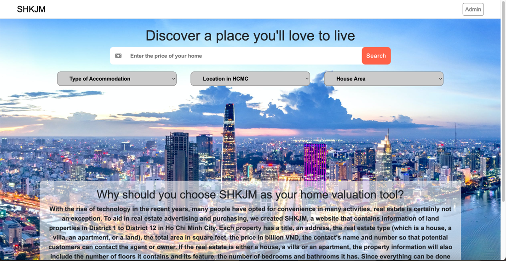
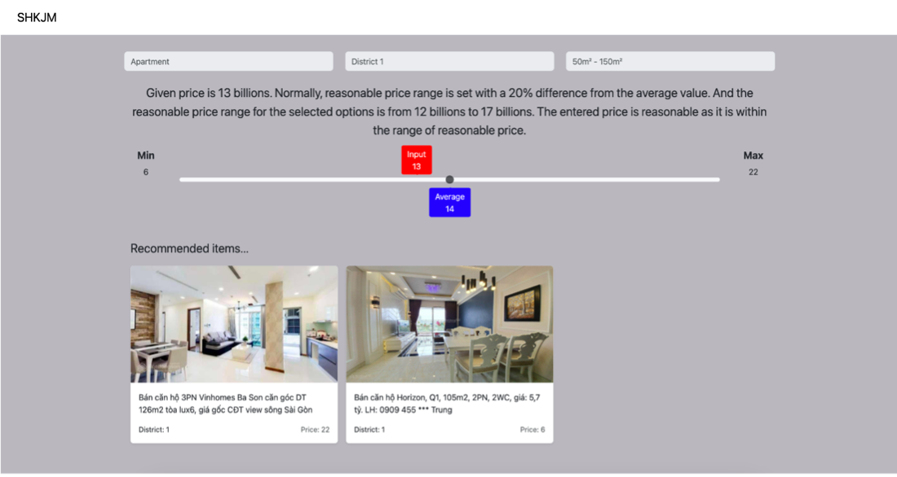
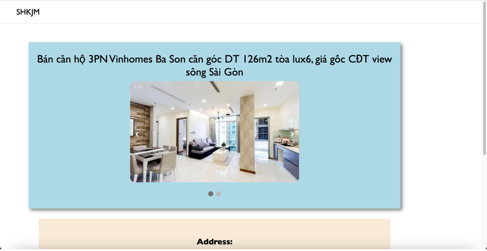
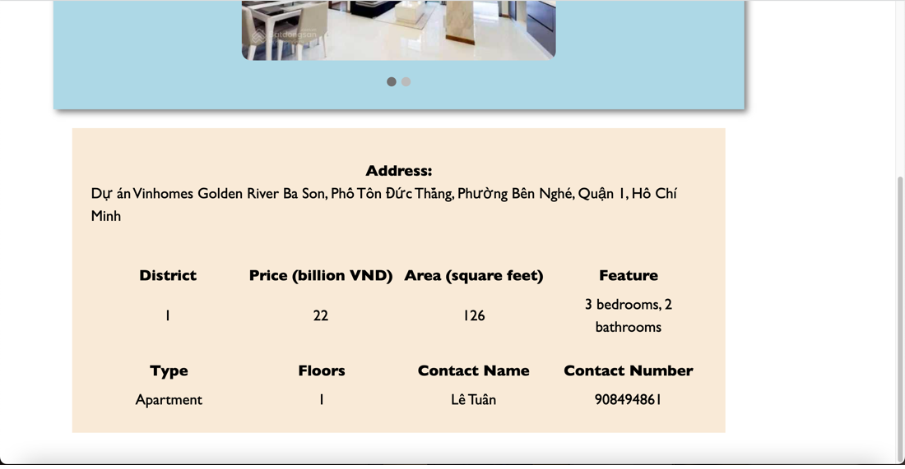
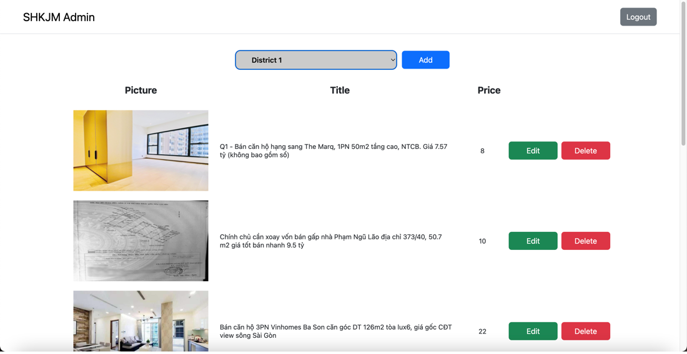

# RealEstate

RealEstate is an online real estate marketplace designed to streamline property advertising and purchasing for users in Ho Chi Minh City. The platform provides detailed property listings across District 1 to District 12, including information such as:

- Title & Address
- Property Type (House, Villa, Apartment, Land)
- Total Area (m²)
- Price (Billion VND)
- Contact Information (Name & Phone Number)
- Number of Floors, Features, Bedrooms, and Bathrooms (for applicable properties)

Users can easily search for properties based on specific criteria and directly connect with sellers. Administrators have additional privileges to manage property listings.

## System Architecture

### 1. Backend
- Spring JPA: Provides a flexible, high-performance ORM framework for handling database transactions.
- Supabase: Cloud-based PostgreSQL database allowing real-time API access.
### 2. User Flow
1. Home Page: Users can search for properties.
2. Search Results: Displays properties matching the criteria.
3. Property Detail Page: Shows full property details and contact information.
4. Admin Panel:
- Add, Edit, and Delete property listings.
- Validate and maintain database consistency.

## Scrennshots

### Landing Page

    

### Result Page

    

### Detail Page

    
    

### Admin Page

    

